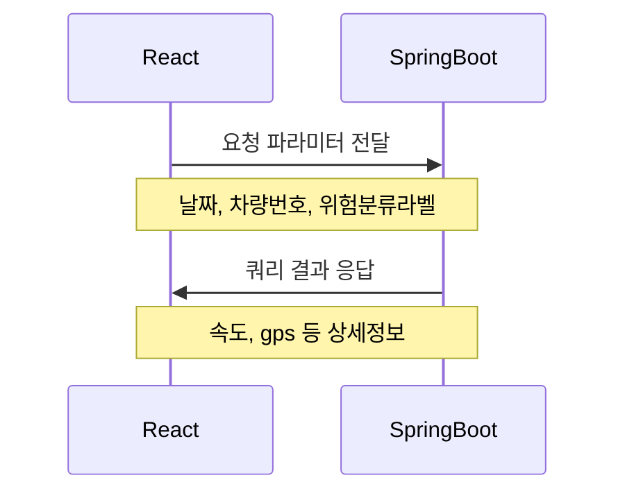
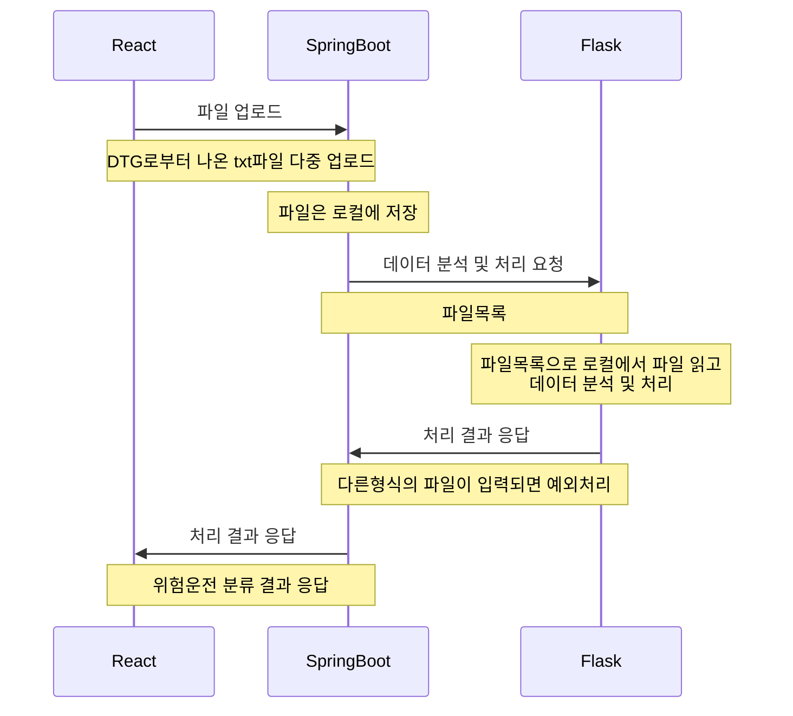
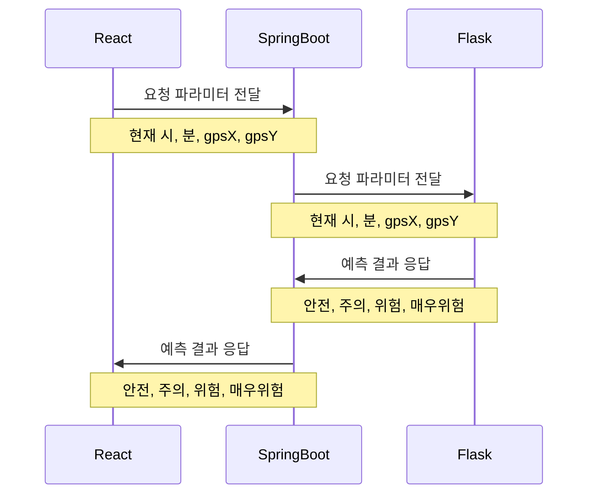

# 사업용 차량 안전 위험 빅데이터/AI 분석 웹 서비스

> 버스 운행기록 데이터를 이용한 빅데이터/AI 분석 웹 서비스
- 본 프로젝트는 DTG를 통해 사업용 차량으로부터 수집되는 주요 정보 중 속도, 위치 등의 데이터를 기반으로 웹서비스를 제공한다.
- 차량 운전자의 위험운전행동 발생구간, 시간대를 지도, 차트를 이용하여 시각적으로 보여준다.
- 운전자의 급감가속 등의 위험운전행동 데이터를 이용하여 위험운전행동 건수 자료를 제공하고 이를 바탕으로 교육 및 안전습관의 개선에 기여하고자 한다.
- 또한 머신러닝을 이용한 시공간에 대한 위험운전 정도 예측결과를 알려줌으로써 해당 구간 운전 시 경각심을 가질 수 있도록 한다.

## 역할
#### ⭐ DA : 데이터 분석
- 데이터 전처리 및 라벨링
- 머신러닝을 사용하여 예측모델 개발
 
#### ⭐ BE : API 및 DB 설계, Flask-Springboot-React간 파이프라인 구축
- DB 설계
- API 설계
- 사용자 인증
- 예외처리

#### ⭐ FE : 사용자 입력 및 시각화
- ApexChart, Kakao지도를 이용한 시각화
- Bootstrap을 이용한 CSS
- 사용자 입력 1차 검증





## 실행
#### ⭐ DA
```bash
$ (venv) pip install -r requirements.txt
$ (venv) flask run
```

#### ⭐ BE
- dependencies : `Spring Web` `Spring Data JPA` `MySQL Driver` `Lombok` `Validation `
```bash
$ cd .\build\libs\
$ java -jar .\springboot-0.0.1-SNAPSHOT.jar 
```

#### ⭐ FE
```bash
# 실행 전 설치
$ npm install axios
$ npm install apexcharts
$ npm install bootstrap@5.3.0-alpha3

# 실행
$ npm start
```

## 세부내용
#### ⭐ [DE](https://github.com/bm20050/driving-record-analysis-for-web-service/tree/main/flask) : `http://localhost:5000`
- App.py

| **No** | **Method** | **URI**        | **Description**                              |
| ------ | ---------- | -------------- | -------------------------------------------- |
| 1      | **POST**   | /file_processing | 업로드한 파일의 전처리 및 위험운전 분류 결과 반환            |
| 2      | **POST**   | /prediction | 시간, 위치정보에 대한 위험운전 예측결과 반환 |

#### ⭐ [BE](https://github.com/bm20050/driving-record-analysis-for-web-service/tree/main/springboot) : `http://localhost:8080/`
- [API 상세 명세](https://github.com/bm20050/driving-record-analysis-for-web-service/blob/main/springboot/API%EB%AA%85%EC%84%B8_v0.1_20230619.pdf)
- drivingController

| **No** | **Method** | **URI**        | **Description**                              |
| ------ | ---------- | -------------- | -------------------------------------------- |
| 1      | **POST**   | api/totalCount | 위험운전 카테고리별 조회결과 반환            |
| 2      | **POST**   | api/prediction | 시간, 위치정보 파라미터 전달 후응답결과 반환 |

- uploadController

| **No** | **Method** | **URI**         | **Description**                                              |
| ------ | ---------- | --------------- | ------------------------------------------------------------ |
| 1      | **POST**   | api/uploadFiles | 업로드파일에 대한 리스트 플라스크로 전달하여 전처리 및 위험운전 분류 응답결과 반환 |

- memberController

| **No** | **Method** | **URI**          | **Description**                 |
| ------ | ---------- | ---------------- | ------------------------------- |
| 1      | **POST**   | api/user/getuser | 현재 로그인 된 유저의 정보 조회 |
| 2      | **POST**   | api/user/join    | 회원가입                        |
| 3      | **POST**   | api/user/login   | 로그인                          |
| 4      | **POST**   | api/user/logout  | 로그아웃                        |
| 5      | **PUT**    | api/user/update  | 회원정보 수정                   |

#### ⭐ [FE](https://github.com/bm20050/driving-record-analysis-for-web-service/tree/main/frontend/jupiter_front) : `http://localhost:3000`
- 리액트 라우터
```javascript
<BrowserRouter>
  <div className="header">
      <Header />
  </div>
  <div className="main">
      <RouteMain />
  </div>
</BrowserRouter>
```
```javascript                   
<Routes>
    <Route path="/" element={<Main />} />
    <Route path="/login" element={<Login />} />
    <Route path="/join" element={<Join />}/>
    <Route path="/myPage" element={<MyPage />} />
    <Route path="/prediction" element={<Prediction />}/>
</Routes>
```
