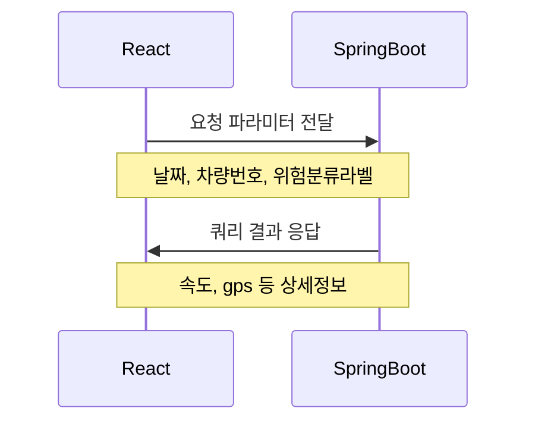
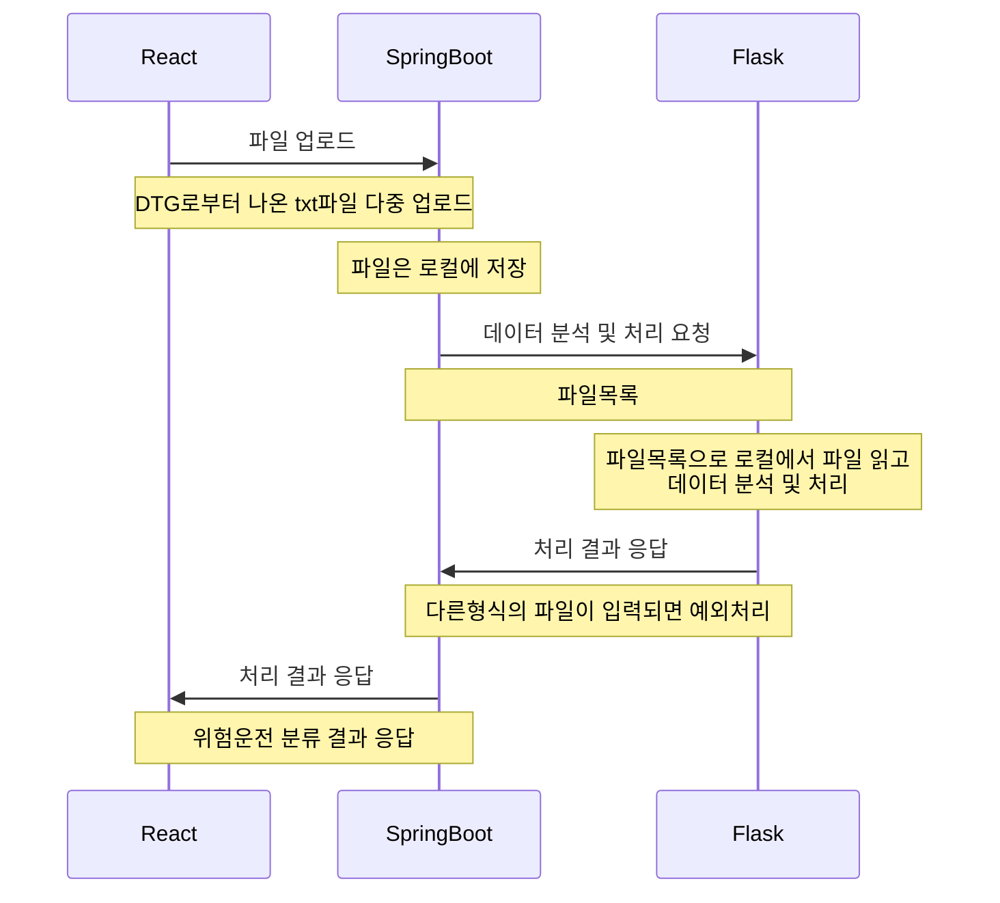
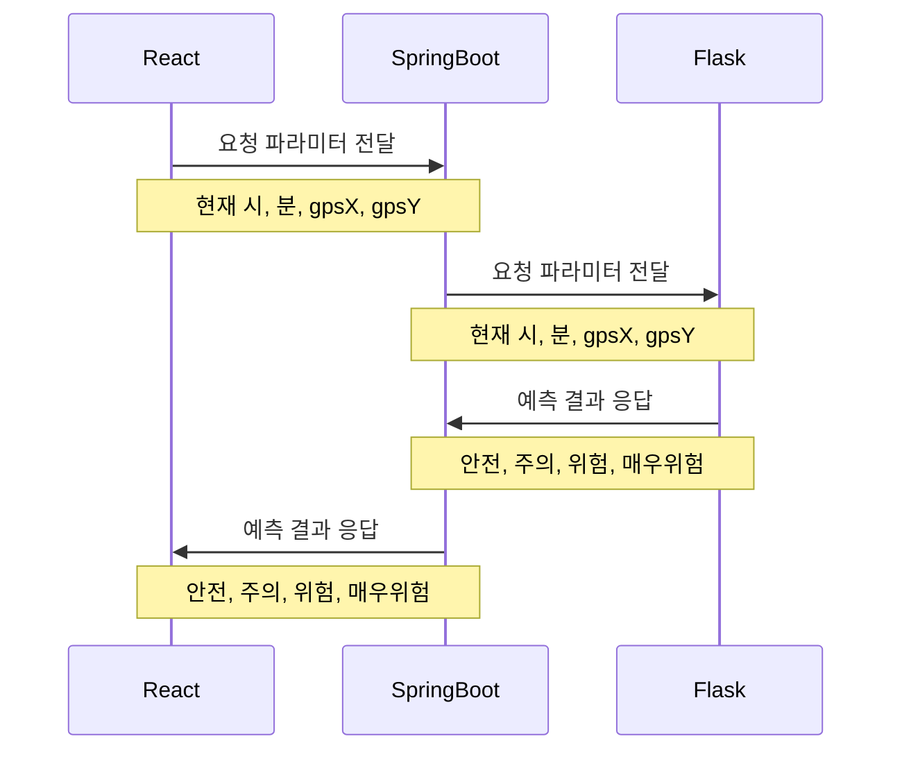

```mermaid
sequenceDiagram
    React->>SpringBoot: 요청 파라미터 전달
    Note over React,SpringBoot: 날짜, 차량번호, 위험분류라벨
    SpringBoot->>React: 쿼리 결과 응답
    Note over React,SpringBoot: 속도, gps 등 상세정보
```

```mermaid
sequenceDiagram
    React->>SpringBoot: 파일 업로드
    Note over React,SpringBoot: DTG로부터 나온 txt파일 다중 업로드
    Note over SpringBoot: 파일은 로컬에 저장
    SpringBoot->>Flask: 데이터 분석 및 처리 요청
    Note over SpringBoot, Flask: 파일목록
    Note over Flask: 파일목록으로 로컬에서 파일 읽고<br/> 데이터 분석 및 처리
    Flask->>SpringBoot: 처리 결과 응답
    Note over SpringBoot, Flask: 다른형식의 파일이 입력되면 예외처리
    SpringBoot->>React: 처리 결과 응답
    Note over React,SpringBoot: 위험운전 분류 결과 응답
```

```mermaid
sequenceDiagram
    React->>SpringBoot: 요청 파라미터 전달
    Note over React,SpringBoot: 현재 시, 분, gpsX, gpsY
    SpringBoot->>Flask: 요청 파라미터 전달
    Note over SpringBoot, Flask: 현재 시, 분, gpsX, gpsY
    Flask->>SpringBoot: 예측 결과 응답
    Note over SpringBoot, Flask: 안전, 주의, 위험, 매우위험
    SpringBoot->>React: 예측 결과 응답
    Note over React,SpringBoot: 안전, 주의, 위험, 매우위험
```